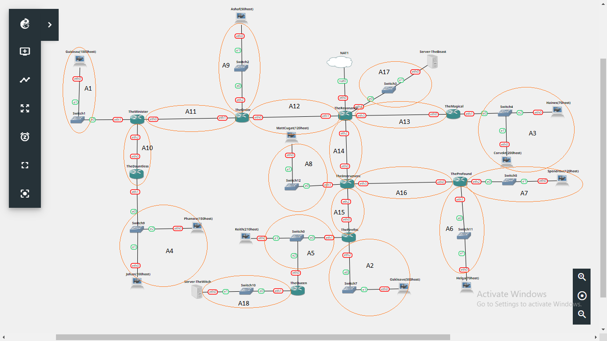
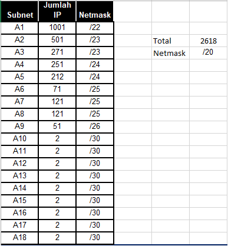
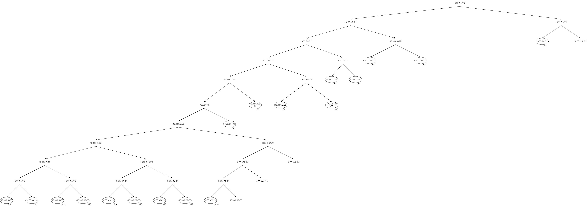
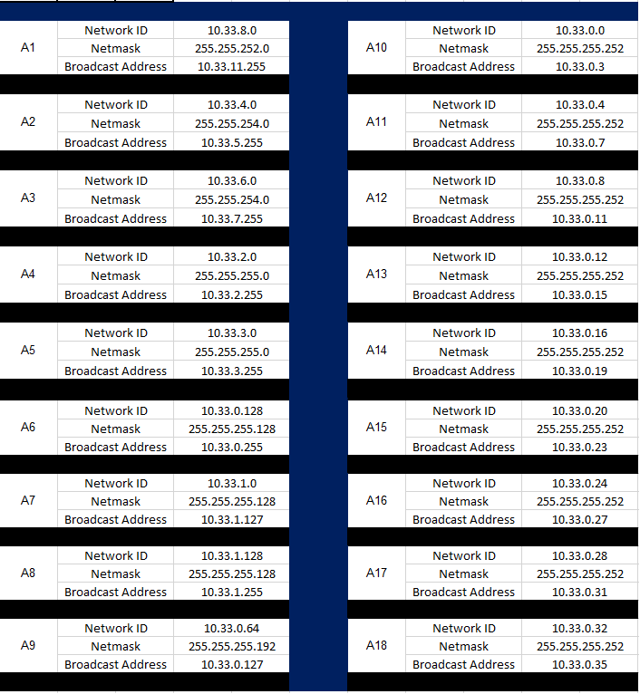
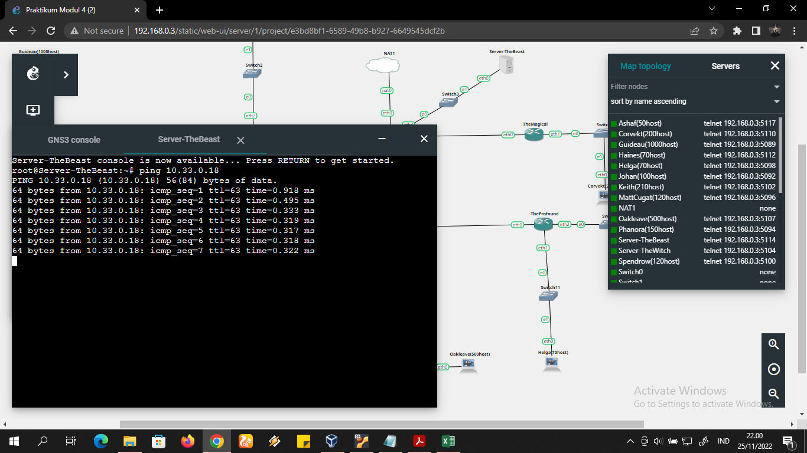

# Jarkom-Modul-4-F09-2022

## Anggota Kelompok

<table>
    <tr>
	    <th>Nama</th>
        <th>NRP</th>
    </tr>
    <tr>
        <td>Muhammad Lintang Panjerino</td>
        <td>5025201045</td>
    </tr>
    <tr>
        <td>Sayid Ziyad Ibrahim Alaydrus</td>
        <td>5025201147</td>
    </tr>
    <tr>
        <td>Wahyu Tri Saputro</td>
        <td>5025201217</td>
    </tr>
<table>

# Routing dan Subnetting dengan VLSM di GNS3

# Topologi

Berikut adalah topologi di GNS3, topologi tersebut sudah dibuat subnet nya juga, sehingga nanti memudahkan dalam menghitung pembagian IP. Setelah itu, kita hitung jumlah alamt IP yang dilakukan oleh tiap subnet sekaligus nanti kita berikan label netmask berdasarkan jumlah alamat IP yang dibutuhkan. Kemudian kita total semua jumlah IP untuk menentukan "start" netmask yang dibutuhkan untuk menghitung pembagian IP.

Berdasarkan tabel tersebut, subnet besar yang dibentuk memiliki NID 10.33.0.0 dengan netmask /20, maka kita tinggal hitung pembagian IP seperti berikut :

Setelah didapatkan IP dan netmask untuk masing - masing subnet, kita bisa masukkan ke tabel terlebih dahulu untuk merapikan dan menata IP

Setelah itu kita tinggal menyetting/menyamakan IP per node di dalam GNS3 dengan cara membuka Network Configuration nya.

# Routing

Setelah menyetting IP di GNS3 nya, kita bisa menambahkan routing dengan cara menambahkan line berikut di console :

`route add -net <NID subnet> netmask <netmask> gw <IP gateway>`

Routing ditambahkan sesuai tujuan, untuk mengecek bisa dengan perintah seperti berikut :

`route -n`

Setelah routing dilakukan, maka kita bisa mengetes dengan cara ping dari client - client atau client - server, salah satu contoh bisa dilihat pada screenshot berikut :

## CIDR (Classless Inter Domain Routing) - CPT (CISCO PACKET TRACER)

### Topologi

Berikut adalah topologi CPT dari kelompok kami:

### Subnetting

Pada subnetting menggunakan perhitungan CIDR ini, terdapat 10 langkah penggabungan subnet yang kami lakukan dari step A sampai step J. Penggabungan subnet tersebut dimulai dari subnet terkecil.

#### Langkah 1

#### Langkah 2

#### Langkah 3

#### Langkah 4

#### Langkah 5

#### Langkah 6

#### Langkah 7

#### Langkah 8

#### Langkah 9

#### Langkah 10

### Pohon Pembagian IP

Berdasarkan perhitungan subnet dan penggabungan subnet yang telah dilakukan, didapatkan subnet terbesar J1 dengan netmask /17. Sehingga didapatkan pembagian IP yang diilustrasikan dengan tree pada gambar berikut ini.

### Tabel Pembagian IP

Kemudian untuk tabel pembagian IP yang lebih detail berada pada <a href="/Tabel%20Pembagian%20IP%20CIDR.pdf">file berikut</a>.
